# 股民舆情与商品看板（stock-radar）

一个零外部依赖（除可选的无头浏览器验收）的本地股市工作站：把 **A 股自选股行情、多源财经舆情、选股器、股吧情绪、棉花与煤炭商品走势、煤炭港口库存与月度进口台账** 聚合到一个页面，
再用从交易知识库（33 本书）里提炼的规则引擎，对个股做可解释的「是否满足自定规则」体检。

> 本工具只做公开数据聚合与规则化统计，**不预测涨跌、不构成投资建议**。

## 界面预览

桌面版（Edge 应用窗口，1600×1000 固定视口截图）：

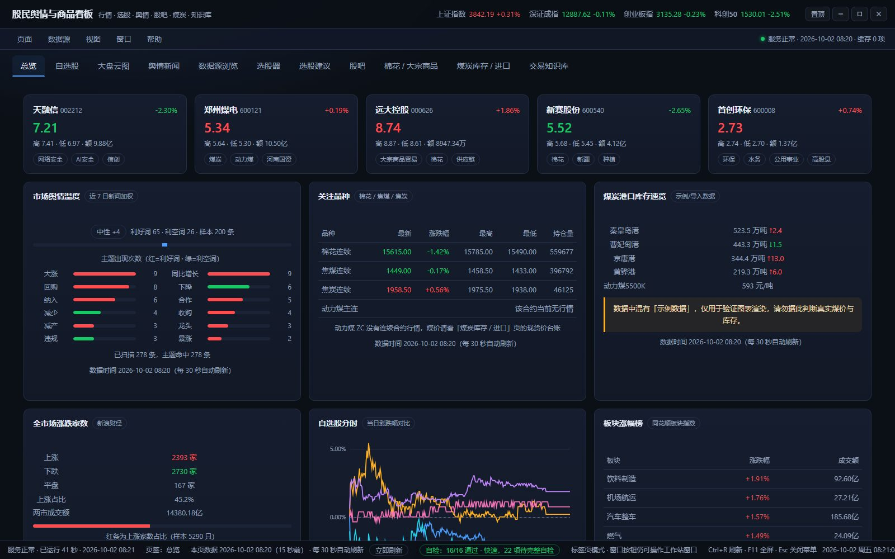

| | |
| --- | --- |
| **自选股 · 行情表 + 主力资金**<br>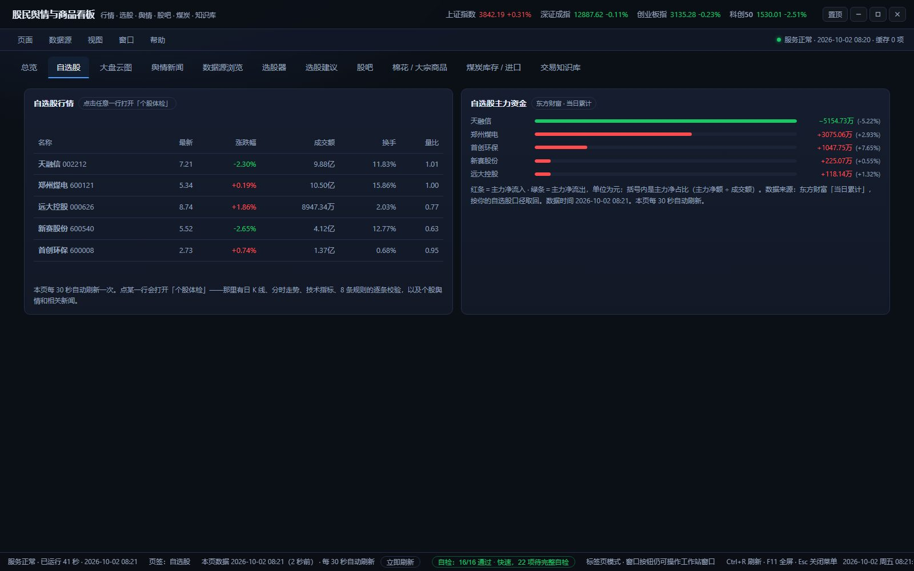 | **个股体检 · 规则评分 + 技术指标 + 分时**<br>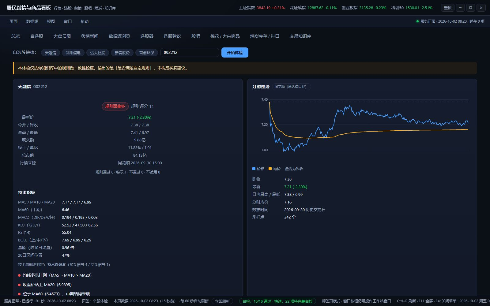 |
| **舆情新闻 · 多源聚合，英文自动转中文**<br>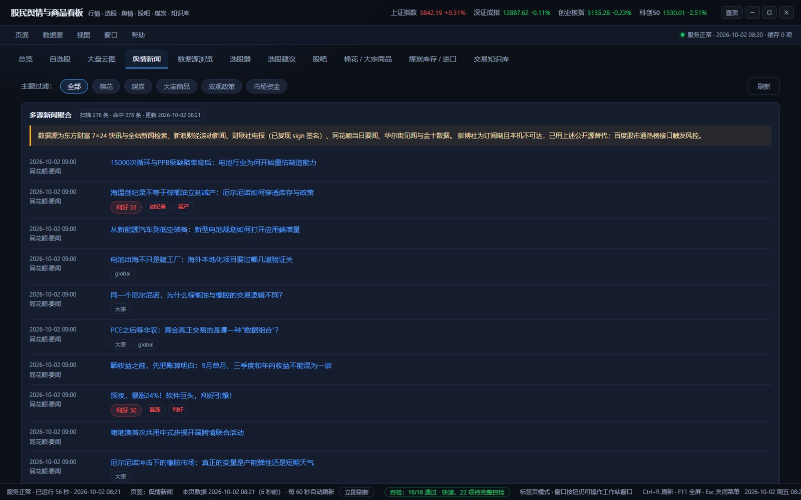 | **选股器 · 条件筛选全市场**<br>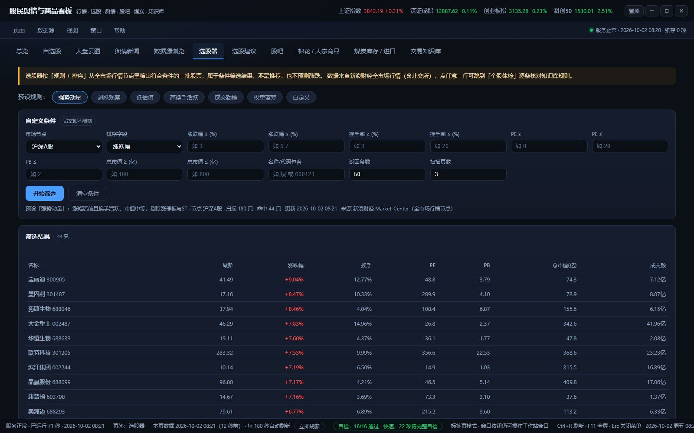 |
| **选股建议 · 规则化候选与理由**<br>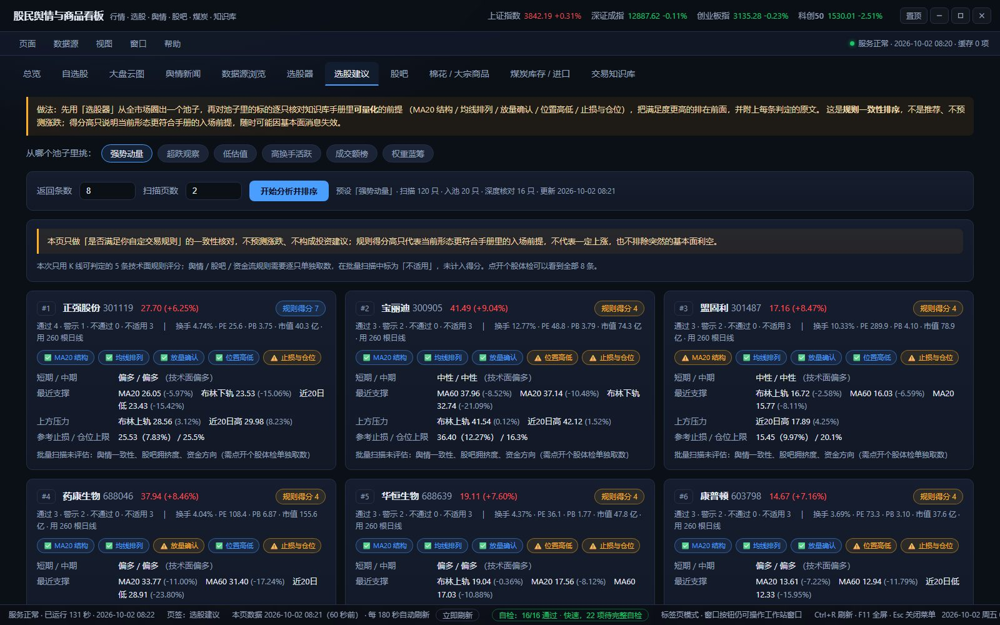 | **棉花 / 大宗商品 · 期货与现货联动**<br>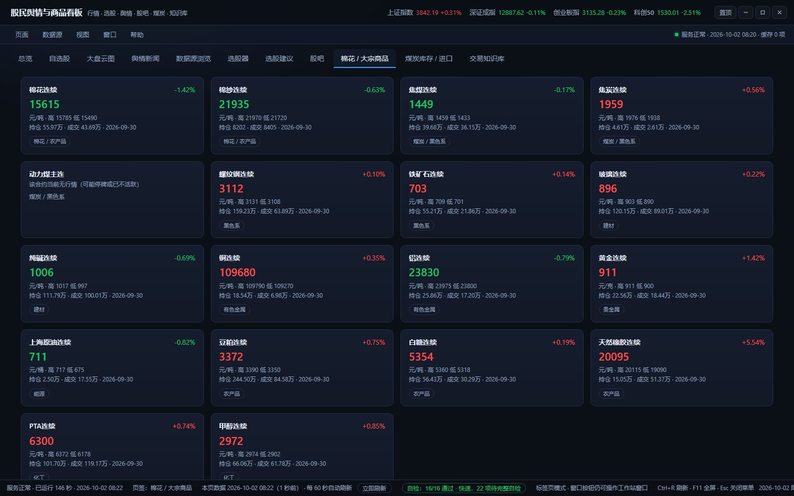 |
| **煤炭库存与进口 · 柱状分析图 + 台账明细**<br>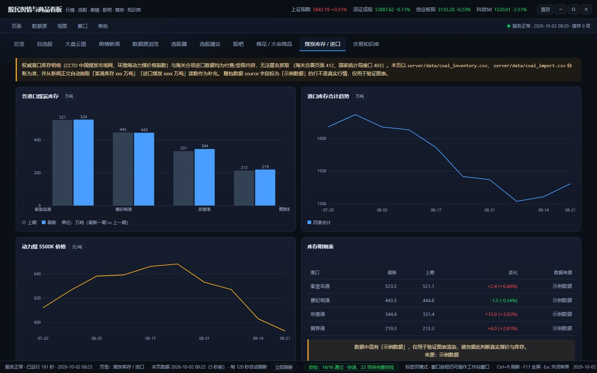 | **股吧情绪 · 人气与多空统计**<br>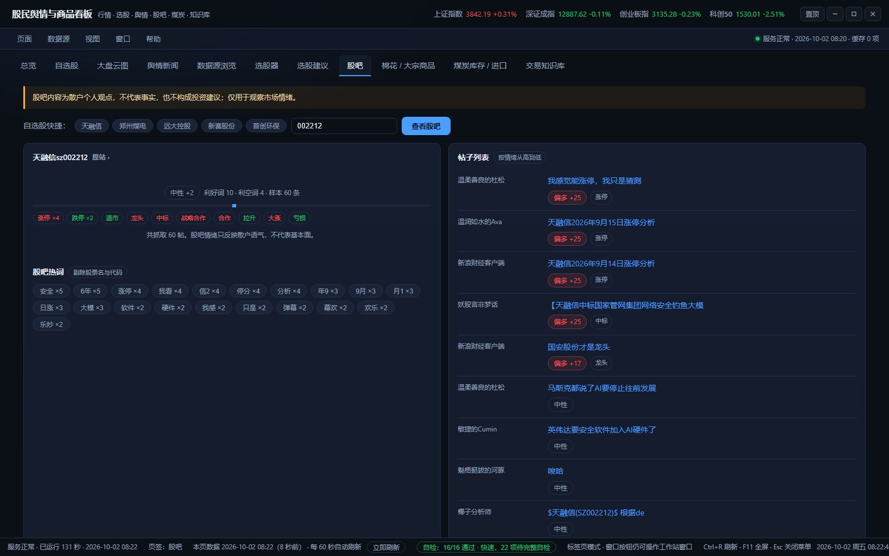 |

**交易知识库**（把交易书提炼成可勾选的规则条目）：

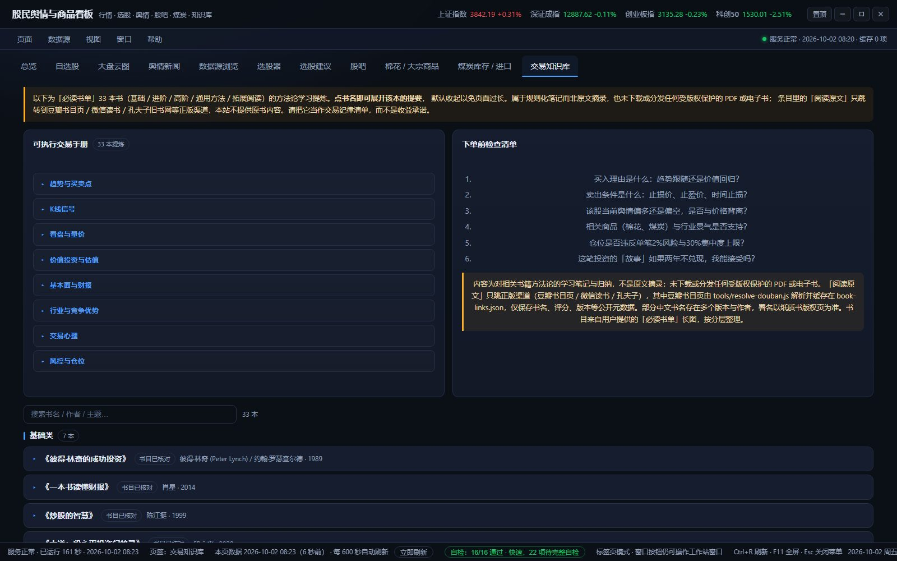

手机端（412×915 安卓视口，页签栏移到底部；桌面专属按钮自动隐藏）：

| | |
| --- | --- |
| 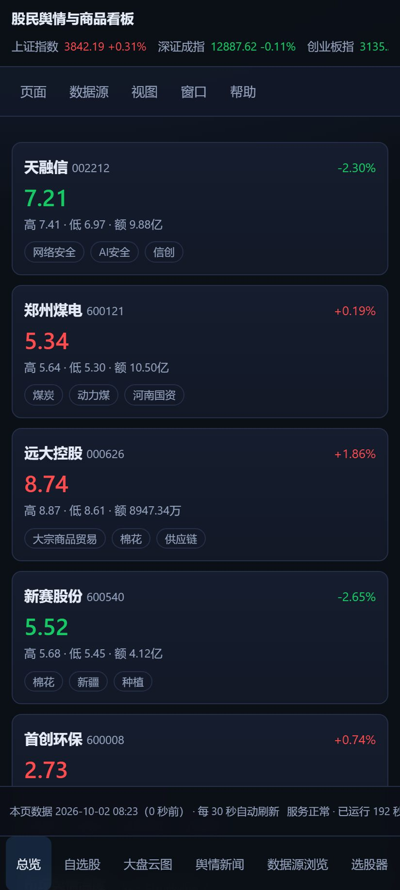 | 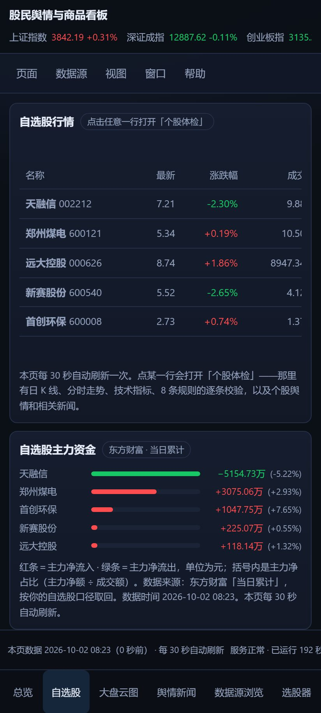 |

## 快速开始

```bash
cd stock-radar
npm start                  # 启动服务，默认 http://127.0.0.1:8787
npm run selftest           # 离线自检（63 项，不依赖外网）
npm run visual             # 可选：无头 Edge 逐页截图验收（需 playwright-core）
npm run mobile             # 可选：412×915 安卓视口验收（溢出 / 页签栏 / 二维码真解码）
```

主服务无第三方依赖，`npm install` 只为 `visual` 验收脚本准备（复用本机 Edge，不下载浏览器）。

### 桌面版（像程序一样用）

`desktop/` 就是「程序入口」。桌面上的快捷方式 **股民舆情工作站** 已经建好，双击即可：

| 入口 | 作用 |
| --- | --- |
| 桌面快捷方式 / `desktop/启动工作站.cmd` | 后台拉起服务 → 用**应用窗口**打开工作站；已经在开着就**直接还原到最前**，不会重复开窗 |
| `desktop/自检工作站.cmd` | 一键自检：本机 + 接口 + 外部数据源逐项打勾，并把报告写到 `selfcheck-report.txt` |
| `desktop/停止工作站.cmd` | 停掉后台服务（只结束占用 8787 端口的 node 进程） |

程序窗口自带标题栏（最小化 / 最大化 / 关闭 / 拖边缩放），页面里另有三处操作入口：

- 顶栏右侧的窗口按钮：**置顶 / 最小化 / 最大化 / 关闭**（通过本机 PowerShell 代理调用 user32，真正操作窗口，只接受 9 条白名单指令）。
- 菜单栏「窗口」菜单：最小化、最大化 / 还原、还原并置于最前、置顶、取消置顶、检查窗口状态、**关闭窗口（连同后台服务一起退出）**。
- 底部状态栏：服务状态、当前页签、**自检结果徽标**（点击展开自检详情）、窗口模式、实时时钟。

**关窗即关程序**：关掉工作站窗口（标题栏 ✕、页面里的「关闭窗口」、菜单栏「窗口 → 关闭窗口」，或 `Alt+F4`）后，
后台服务会在几秒内一起退出，**不会留在后台运行**。只想收进任务栏、下次秒开，请点「**最小化**」而不是关闭。
另外 `停止工作站.cmd` 仍可用于「窗口还开着但想把服务一起停掉」的场合。

**第一次双击、或服务没起来时**：启动器先在后台把服务拉起来（最多等 60 秒），全程不弹任何对话框——
在隐藏窗口里弹对话框没人能点，会把启动卡死。真的起不来时，它把原因写进 `desktop/last-error.txt`，
并额外开一个可见窗口把错误摆给你看。桌面版实测：服务就绪约 4 秒、工作站窗口约 5 秒出现。

> 目录名可以带空格（本项目就放在带空格的 `New project` 目录下）。但不要拆开 `desktop` 和 `server` 两个子目录，
> 也不要手改 `.cmd` 里的相对路径；换目录后跑一次 `setup-shortcut.ps1` 重建快捷方式即可。

### 工作站自检（判断「还能不能用」）

界面里有两个入口：菜单栏「帮助 → 运行工作站自检…」，或点状态栏的自检徽标。

- **快速自检**（秒级）：本机文件、数据台账、算法引擎、窗口能力。
- **完整自检**（联网，约 30–90 秒）：额外检查 HTTP 接口与财联社 / 东方财富 / 同花顺 / 新浪 / 华尔街见闻 / 金十数据 / 股吧 / 选股器 / 期货等外部数据源。

结果按分组逐条显示 ✔ / ✕ / ○，并显示每项耗时；「未执行」只表示快速自检没覆盖，不等于失败。也可以用接口看：
`GET /api/selfcheck?scope=local|full`。

### 自动刷新节奏（不会再「打开一次就永远缓存」）

页面按「数据新鲜度」取数；某一格失败只影响那一格，而且**失败不会被记成成功**，所以永远有下一次重试。

| 页签 | 新鲜度 |
| —— | —— |
| 总览 | 30 秒 |
| 舆情新闻 / 数据源浏览 / 股吧 / 个股体检 / 棉花大宗商品 | 60 秒 |
| 煤炭库存 / 进口 | 120 秒 |
| 选股器 / 选股建议 | 180 秒 |
| 交易知识库 | 600 秒 |
| 大盘云图（第三方嵌入页） | 600 秒（只复检「对方还让不让嵌」，不会把页面重新加载一遍） |

到点后自动重取当前页；状态栏显示「本页数据 时:分:秒（N 秒前）· 每 N 秒自动刷新」，旁边就是「立即刷新」按钮。
页面切到后台（标签页不可见）时暂停刷新，切回来立刻补一次。
后台服务重启、或界面代码更新后，页面会在 15 秒内检测到并**自动重新加载**，不用手动刷。

请求也有超时保护（普通接口 30 秒、选股/建议/煤炭抽取等慢接口 90 秒），
上游卡住时页面会明确报「等了 N 秒还没返回」，不会一直停在「加载中…」。

## 手机访问（安卓手机 / 局域网）

服务启动时监听 `0.0.0.0:8787`（不是只监听 `127.0.0.1`），所以**手机和电脑连同一个 Wi-Fi 就能直接打开**，
不需要再写一个「接口」，也不需要中转服务器。启动日志里会打印真实可用地址，形如
`http://192.168.0.101:8787/?app=1`（局域网 IP 每次换网络都可能变）。

| 步骤 | 做法 |
| --- | --- |
| 1. 拿地址 | 菜单栏「帮助 → 手机访问（扫码 / 局域网地址）」，里面有实时地址和二维码；总览页也有一张「手机访问」卡片（只在电脑上显示），同样给二维码 |
| 2. 手机打开 | 相机扫码，或浏览器手动输入 `http://192.168.x.x:8787/?app=1` |
| 3. 放行防火墙 | 电脑上能开、手机打不开，几乎一定是 Windows 防火墙拦了入站。**以管理员身份运行一次** `desktop/允许手机访问.ps1`（双击同名 `.cmd` 会自动提权），只放行 TCP 8787 的**专用/域**网络，可重复执行；加 `-Remove` 撤销 |
| 4. 装成 App | 安卓 Chrome 打开后，右上角菜单 →「添加到主屏幕 / 安装应用」。它是 PWA（`manifest.webmanifest` + `service worker`），装完有独立图标、全屏无地址栏 |

### 不在同一个局域网？（Tailscale 异地访问）

上面那个 `192.168.x.x` 只在同一个局域网里可路由——手机用 4G、或连别家 Wi-Fi 就打不开。
要让手机在任何网络下都能连，用 **Tailscale**（基于 WireGuard 的异地组网，个人用免费）：

| 步骤 | 做法 |
| --- | --- |
| 1. 电脑 | 装 Tailscale 并登录（本机已装 1.102.4，`tailscale-setup-<版本>-amd64.msi`） |
| 2. 手机 | 应用商店搜 **Tailscale** 安装，用**同一个账号**登录 |
| 3. 访问 | 打开「帮助 → 手机访问」里的 **异地访问** 地址（形如 `http://100.x.y.z:8787/?app=1`），也可以扫那一栏的二维码 |

- **没有把 8787 暴露到公网**：Tailscale 是加密的点对点隧道，只有加入你 tailnet 的设备能连；
  防火墙那条规则也是**按网卡**放行的，Wi-Fi / 网线那边不受影响。
- 面板会分两段显示：`同一个 Wi-Fi` 给局域网地址，`异地访问` 给 Tailscale 地址，各配一个二维码。
- 装了但**没登录**时不会有 `100.x` 地址，面板会明确写「Tailscale 已安装，但还没登录」并给出登录入口，
  不会让你误以为装失败了。
- 顺带一提：用 Tailscale 依然是 `http://`，所以浏览器仍不给注册 service worker；
  想要「完整安装 + 离线缓存」，需要 `https`（例如再叠一层 Cloudflare Tunnel）。

### 手机上做了哪些适配

- **视口**：`viewport-fit=cover` + 主题色，适配刘海屏与安卓手势条（底部按 `env(safe-area-inset-bottom)` 留白）。
- **导航**：顶部页签栏在窄屏改成**屏幕底部固定 tab bar**，可横向滑动，当前页签会自动滚进视野；菜单栏可横滑，最右两个下拉改右对齐，不会越出屏幕。
- **布局**：所有网格在窄屏降为**单列**；表格外面包一层横向滚动容器（不挤压列宽）；K 线与柱状图按容器宽度重绘。
- **触控**：主要按钮命中区 ≥ 42px，输入框字号 16px（点一下不会把整页放大）。
- **减法**：窗口按钮、总览的「手机访问」卡片等桌面专属内容在手机上自动隐藏。

> 窄屏必须写 `minmax(0, 1fr)` 而不是 `1fr`：`1fr` 等价于 `minmax(auto, 1fr)`，卡片里只要有张
> `min-width: 520px` 的表格，轨道就会被撑到 520px 以上，整页横向溢出；而安卓 Chrome 遇到横向溢出会
> **加宽布局视口**，结果是把固定在底部的页签栏顶到屏幕外面，点都点不到。`test/mobile-check.js` 就是守这条的。

### 关于「打包成 APK」：没做，也不建议做

本机没有 Android SDK / Gradle 工具链，真要出 APK 得装一整条安卓构建链，还要自己维护签名和升级。
而这个工作站的价值在**实时聚合跑在本机服务上的数据**，套一层 WebView 壳不会多出任何功能，只会多一个要更新的安装包。
所以选 **PWA**：安卓上同样是「独立图标 + 全屏 + 加到主屏幕」，而且界面更新后手机端**自动就是最新版**，不用重新安装。

> 局域网是 `http://`，不是安全上下文，浏览器**不允许注册 service worker**，所以这种访问方式下离线缓存不会启用——
> 页面功能完全正常，只是断网时打不开。界面上会如实写出原因，不会假装注册成功。
## 页面（11 个页签 + 桌面式菜单栏 + 状态栏）

| 页签 | 内容 |
| --- | --- |
| 总览 | 指数条、五只自选股卡片、市场舆情温度（含主题条形榜）、关注品种（棉花/焦煤/焦炭：最新·涨跌·最高·最低·持仓）、煤炭库存速览、全市场涨跌家数（含涨/平/跌分布条）、**自选股分时图**（5 只当日涨跌幅同图对比，0% 虚线为昨收基准）、板块涨幅榜、最新快讯 |
| 自选股 | 行情表 + **自选股主力资金净流入榜**（东方财富当日累计，红=流入／绿=流出，含主力净占比，与行情表并排一屏看完）→ 点击任意一行打开「个股体检」 |
| 舆情新闻 | 多源新闻聚合，按 棉花／煤炭／大宗商品／宏观／市场资金 过滤，逐条标注情绪分与命中词 |
| **数据源浏览** | **按你点名的源逐个浏览**（财联社／东方财富 7×24／同花顺／新浪财经／华尔街见闻／金十数据），并如实列出「点名源 vs 实际接入状态」对照表 |
| **选股器** | 6 个内置预设（强势动量／超跌观察／低估值／高换手活跃／成交额榜／权重蓝筹）+ 自定义条件（涨跌幅、换手、PE、PB、市值、名称），结果可点击跳转体检 |
| **选股建议** | 先圈池子再逐只跑技术面规则：规则得分排序、通过/警示/不通过计数、短期与中期判定、支撑压力位、参考止损与**仓位上限**；严格条件今日无命中时会**自动放宽为「相对强势」口径并在页面上标注** |
| **股吧** | 输入代码看散户讨论：情绪聚合、股吧热词云、逐帖情绪标签（口语词表：垃圾／割肉／涨停／主力…） |
| **个股体检** | 从「自选股」点任意一行进入（已不占页签，因为它只服务于自选股）。8 条知识库规则逐条判定（通过／警示／不通过／不适用）、**日 K 线**（近 120 个交易日 + MA5/10/20）、技术指标表、分时图与日内摘要、走势分析、个股舆情、股吧情绪、当日资金 |
| 棉花 / 大宗商品 | 18 个主力连续合约实时行情，CF（棉花）与 JM（焦煤）走势图，主题新闻 |
| 煤炭库存 / 进口 | 各港口库存柱状图、合计趋势、动力煤价格、明细表、**月度进口量柱状图**、进口台账（环比/同比）、新闻抽取读数、两个 CSV 导入 |
| 交易知识库 | 33 本书（基础／进阶／高阶／通用方法／拓展阅读）的可执行手册、下单前检查清单、每本书的核心观点／方法／陷阱。书目默认收起、点书名展开，支持按书名／作者／主题搜索。每本带「阅读原文」，**直链到该书在豆瓣的具体书目页**（已解析到版本，按钮上带评分与「可试读／有电子版」标记），另附微信读书与孔夫子。拓展阅读层为企业战略、财商与传记类，只作背景，不产出交易规则 |
| **大盘云图** | 原样嵌入金融界「大盘云图」（全市场按行业分块的涨跌热力图）；另给「涨跌停温度计 / 龙虎榜」入口，这一页每次进入都先探测对方是否允许嵌入，不允许就如实说明并给新窗口入口 |

## 数据来源与真实性

| 数据 | 实际来源 | 说明 |
| --- | --- | --- |
| A 股实时行情 | 同花顺 realhead | 主用；字段位已与东方财富交叉验证 |
| 日 K 线 / 分时 | 同花顺 line / time | 日 K 字段序为 `date,open,high,low,close,volume,amount`（与东财不同） |
| 全市场行情（选股器） | 新浪财经 Market_Center | 覆盖沪深 A、创业板、科创板、北交所 |
| 指数 | 新浪财经 | 上证／深证／创业板／科创50／中证500 |
| 涨跌家数 | 东方财富 push2 (`f104/f105/f106`) | 全市场上涨／下跌／平盘家数与成交额 |
| 板块行情 | 同花顺 `bk_` 板块指数 | 65 个板块（43 行业 + 22 概念），东财 clist 全市场接口本机不可用 |
| 涨停池 | 东方财富 push2ex | 含连板数与封板资金 |
| 个股资金流 | 东方财富 push2 (`f62/f184` 等) | 主力／超大单净额与净占比；该接口带 `fltt=1`，百分比字段被放大 100 倍（`f184=441` 表示 4.41%），取数时已除回 |
| 7×24 快讯 | 东方财富 | 全球快讯 |
| 全站新闻检索 | 东方财富 search-api-web | JSONP，需剥壳 |
| 滚动新闻 | 新浪财经 | 已过滤生活类噪声 |
| 财联社电报 | **财联社（已复现 sign 签名）** | 参数按 key 升序拼 `k=v&k=v` → sha1 → 再 md5；`rn` 上限 50 |
| 同花顺要闻 | 同花顺 today_list | 当日要闻 |
| 全球快讯 / 热门 | 华尔街见闻 lives + hot | 作为彭博社的公开替代源 |
| 实时快讯 | 金十数据 flash | 作为彭博社的公开替代源；英文稿**自动机翻成中文**并保留英文原文（见下节） |
| 股吧讨论 | 新浪「股市汇」股吧 | GB2312；东财股吧接口返回「系统繁忙」，雪球需登录态 |
| 期货实时 / 历史 | 新浪财经 | GBK 编码；`ZC0` 动力煤通常无行情 |
| 煤炭港口库存 | **本地 CSV 台账 + 新闻抽取** | 权威源（CCTD、环渤海指数）为付费数据 |
| 煤炭月度进口 | **本地 CSV 台账 + 新闻抽取** | 海关总署页面 412、国家统计局接口 403，无法匿名取数 |
| 大盘云图 / 涨跌停温度计 / 龙虎榜 | **金融界原始页面（iframe 原样嵌入）** | 不做转发、不缓存、不改写；能否嵌入由对方的 `X-Frame-Options` 决定，进页面时先探测并如实提示 |

**重要：`server/data/coal_inventory.csv` 与 `server/data/coal_import.csv` 中 `source` 字段为「示例数据」的行不是真实数据**，
仅用于验证图表渲染与交互（共 14 个月 × 2 品种）。页面对此有显式提示；请用真实数据覆盖后再用于决策。

### 点名源接入状态（界面「数据源浏览」页也有同样一张表）

| 点名源 | 状态 | 说明 |
| --- | --- | --- |
| 财联社 | 已接入 | 复现网页端 sign 签名后可直接取电报 |
| 东方财经（东方财富） | 已接入 | 行情、7×24 快讯、全站新闻检索 |
| 同花顺 | 已接入 | 实时行情、日 K、分时、板块指数、当日要闻 |
| 彭博社 | 不可用 | bloomberg.com 及 RSS 在本机网络不可达且为订阅制；用华尔街见闻 + 金十数据替代 |
| 百度股市通 | 部分接入 | 行情／分时／盘口接口可用，热榜接口触发风控（`hit risk`） |

### 英文快讯自动翻译成中文

金十数据的快讯里有不少是英文原稿（标题和正文都可能是整句英文），看不懂就等于没看到。工作站会把它们**自动翻成中文**：

- **界面**：中文译文在上，英文原文用灰色小字保留在下面一行，并标「机翻」小标签 —— 想核对原话随时能看到。
- **翻完再算舆情**：先把译文补上，再算主题（棉花／煤炭……）与情绪分。否则英文条目既进不了主题筛选、情绪分也永远是 0，等于在舆情统计里凭空消失。
- **只翻真英文**：短代码（`AAPL`）、带数字的短句、中文稿一律**不发请求**；送翻前还会摘掉 `(MRVL.O)` 这类括号代码 —— 翻译引擎会把它当股票去查，返回「（mrv . o：行情）」这种乱码，实测甚至会把「上调至」翻成「降至」，方向都反了。
- **能用哪两个免费接口**（本机实测，其余都不可用）：有道 `aidemo.youdao.com`（措辞更准，但连发几条就返回 `errorCode 411`，约 10 秒自动恢复）与 MyMemory（稳定，匿名有每日字符额度）。谷歌 / Bing / Edge / 腾讯 / 搜狗 / Yandex 在本机网络下分别表现为超时、空响应、404 或签名要求，因此没有采用。
- **限速 + 跳过冷却**：有道 1.3 秒一条、MyMemory 0.45 秒一条；某个源被限流时**直接跳过、不等它**（早期版本会把冷却期一起等，一条要干等十几秒，滚动快讯永远追不上）。
- **后台队列**：英文稿一出现就进队列，后台按上游能承受的速度持续翻，翻好写进持久缓存（`server/data/translate-cache.json`）—— 同一条英文一辈子只翻一次，重启不重翻，页面再打开时中文是现成的，不用等。
- **有硬上限**：单次请求最多等 7 秒、最多新翻 10 条，翻不完就留给后台队列和下一轮，**绝不为了翻译把新闻页卡住**。
- **不编造**：两个源都不可用时保留英文原文并标注「未翻译」。

翻译引擎的实时状态：`GET /api/translate/status`（缓存条数、队列剩余、各源成功/失败与冷却情况）。

## 煤炭数据的两条腿

1. 手工／批量维护台账（也可在页面上直接粘贴 CSV 导入）：
   - 库存：`server/data/coal_inventory.csv`，`date,port,metric,value,unit,source`
   - 进口：`server/data/coal_import.csv`，`period,variety,value_10kt,yoy_pct,amount_usd,source`
2. 从新闻正文正则抽取读数（标注 `news-extracted`，需人工复核）。抽取覆盖三种中文语序：

   - A「8 月中国炼焦煤进口量为 1345.6 万吨」——品种在前、进口在后
   - B「8 月份，我国进口煤炭 4209 万吨，同比下降 1.5%」——**进口在前、品种在后（主流写法）**
   - C「进口煤炭 4209 万吨」——无月份时不产出（只有上文 40 字内出现「N 月」才采信，避免把 8 月数据记成 9 月）

   另有量级合理性校验（煤及褐煤 400–8000 万吨、炼焦煤 50–2500 万吨等），避免把乙二醇、原油误当煤炭。
   跨年属月也会修正：2026-01 的报道里出现「12 月」会归入 2025-12。

## 情绪引擎

`server/lib/sentiment.js` 是**词典 + 修饰词加权**模型，不是大模型推理：

- 利好／利空词表带权重 1–3；强修饰词（大幅、超预期）放大 1.5 倍；
- 否定词（不、未、无）在词前 12 字窗口内出现时翻转极性；
- 归一化到 −100…100，并映射为「强烈偏多／偏多／中性／偏空／强烈偏空」；
- 聚合多条目时按 72 小时时间衰减加权，越新的新闻权重越高；
- 股吧另有一层口语词表（`server/sources/guba.js` 的 `GUBA_BULLISH/BEARISH`），权重 2，与通用词表结果相加。

局限：只识别显式措辞，反讽与隐性利好会偏保守。因此界面始终展示**命中词**，便于人工复核。

## 个股体检的 8 条规则

规则来自 `docs/books/` 交易知识库（33 本书）的提炼，实现于 `server/sources/analysis.js` 的 `PLAYBOOK_RULES`：

| id | 规则 | 依据 |
| --- | --- | --- |
| trend-above-ma20 | 收盘站稳 MA20 且 MA20 向上才属于可持有结构 | 趋势与买卖点 / 均线 |
| not-falling-knife | 不接下跌趋势中的便宜货（均线空头排列不参与） | 趋势与买卖点 |
| volume-confirm | 突破需要放量确认（≥ 10 日均量 1.5 倍） | K 线信号 / 量价 |
| not-chasing-high | 不买在情绪顶部（区间高位 + 指标过热则回避） | 股剩是怎么炼成的 / 反人性 |
| sentiment-price-consistency | 舆情与价格应相互印证，背离时降低信任度 | 交易心理分析 / 一致性 |
| guba-crowding | 股吧极度一致时需警惕（散户一致预期常是反向指标） | 股吧情绪（辅助） |
| fund-flow | 主力资金净流入方向与价格方向一致时信号更可靠 | 看盘方法和技巧 / 资金 |
| stop-loss-plan | 下单前必须定义止损：单笔风险 ≤ 2% 总资金，**且**单只 ≤ 30% 仓位，两条取更严者 | 风控与仓位 |

体检结论是 `pass*2 - warn - fail*3` 的加权评分：≥ 4 判「规则面偏多」，≤ −2 判「规则面偏空」，其余为「规则面中性」。
它只表示「满足自定规则的程度」，不代表预期收益。

## API

```
GET  /api/health                    服务与缓存状态（含 startedAt / appVersion / uptimeSec）
GET  /api/overview                  指数 + 自选股 + 关键商品 + 煤炭/进口摘要
GET  /api/embed                     可嵌入的第三方页面白名单（目前只有金融界三个页面）
GET  /api/embed/:id/preflight       探测该页现在能不能被 iframe 嵌入（含对方禁止嵌入的原因）
GET  /api/watchlist                 自选股配置
GET  /api/stock/:code               个股行情 + K线 + 均线 + 技术面 + 舆情 + 新闻
GET  /api/analysis/:code            个股规则化体检（8 条规则 + 指标 + 舆情 + 股吧 + 资金流）
GET  /api/guba/:code                股吧帖子、情绪聚合、热词
GET  /api/screener?preset=&...      选股器（preset / node / sort / 各类过滤 / limit / pages）
GET  /api/screener/presets          选股器预设、市场节点、可排序字段
GET  /api/market                    涨跌家数 + 板块行情 + 板块资金流
GET  /api/market/limitup?date=      涨停池
GET  /api/news?topics=&limit=       聚合新闻（topics: cotton,coal,commodity,macro,market）
GET  /api/sources                   数据源清单 + 点名源接入状态对照
GET  /api/sources/:id               按源浏览（cls/em724/ths/sina/wscn/jin10）
GET  /api/cls/telegraph?limit=      财联社电报 + 热门概念
GET  /api/ths/:code/quote|daily|minute   同花顺行情／日K／分时
GET  /api/futures                   商品主力连续实时行情
GET  /api/futures/:symbol/daily?limit=   期货历史日线
GET  /api/coal/inventory            煤炭港口库存台账（柱状图数据）
GET  /api/coal/import               煤炭月度进口台账（按品种分组）
GET  /api/coal/extract              新闻抽取的库存／煤价／进口读数
POST /api/coal/inventory/upload     导入库存 CSV（body 为纯文本或 {"csv":"..."}）
POST /api/coal/import/upload        导入进口 CSV
GET  /api/advice?preset=&limit=&pages=   选股建议（圈池 + 逐只技术面规则评分排序）
GET  /api/trend/:code               个股走势分析（多周期 + 支撑压力 + 参考止损/仓位上限）
GET  /api/selfcheck?scope=local|full     工作站自检（本机 / 联网两档）
GET  /api/window/state              窗口状态（标题、是否应用窗口、是否最小化/最大化）
                                     副作用：见到应用窗口后即武装「看门狗」——
                                     窗口消失（连续两次查不到）就退出后台进程（关窗即关程序）
POST /api/window/:action            窗口控制（minimize/maximize/restore/close/topmost-on/topmost-off/focus，白名单）
GET  /api/knowledge                 交易知识库（33 本书）
```
`/api/health` 的 `startedAt` 是服务启动时刻、`appVersion` 是前端 `app.js` 的「大小 + 修改时间」指纹、`uptimeSec` 是运行秒数。
前端每 15 秒轮询一次：`startedAt` 变了说明服务重启过，`appVersion` 变了说明界面代码换过，
两种情况都只做一件事——提示并自动重新加载页面，避免一直看着旧界面 / 旧数据。

## 自定义

- 自选股：编辑 `server/data/watchlist.json`（代码、名称、标签、关注要点）。
- 情绪词表：编辑 `server/lib/sentiment.js` 的 `BULLISH` / `BEARISH`；股吧口语词在 `server/sources/guba.js`。
- 商品品种：编辑 `server/sources/futures.js` 的 `COMMODITIES`。
- 主题词表：编辑 `server/lib/feed.js` 的 `TOPIC_KEYWORDS` 与 `server/sources/news.js` 的 `PROBES`。
- 板块清单：编辑 `server/data/sectors.json`（65 个同花顺 `bk_` 板块）。
- 选股预设：编辑 `server/sources/screener.js` 的 `PRESETS`。

## 目录结构

```
stock-radar/
├── server/
│   ├── index.js               HTTP 服务与路由
│   ├── lib/                   http（GBK/JSONP）、cache、sentiment、feed（主题分类）、indicators（技术指标）、
│   │                          translate（英文快讯机翻：限速队列 + 跳过冷却 + 持久缓存）、
│   │                          window（调用 PowerShell 窗口代理）、selfcheck（工作站自检）、
│   │                          net（局域网地址枚举）、qr（纯手写二维码编码器，无第三方依赖）
│   ├── sources/               quotes、ths、cls、news、global、futures、coal、coalImport、
│   │                          market、guba、screener、analysis、advice（选股建议 / 走势分析）、
│   │                          embed（可嵌入的第三方页面白名单 + 能否嵌入探测）
│   └── data/                  watchlist.json、coal_inventory.csv、coal_import.csv、
│                              knowledge.json、sectors.json、
│                              translate-cache.json（机翻缓存，删掉只会重翻一遍，不影响功能）
├── public/                    index.html、styles.css、app.js（Canvas 绘图，无前端框架）、
│                              manifest.webmanifest + sw.js + icons/（PWA：可「添加到主屏幕」）
├── desktop/                   桌面启动器：启动 / 停止 / 自检 / 图标 / 窗口代理（window-agent.ps1）、
│                              允许手机访问.ps1（防火墙放行 TCP 8787，可 -Remove 撤销）
├── docs/books/                交易知识库的书籍学习提要（33 本，由 tools/book-to-skill.js 生成）
├── docs/images/               README 里的界面预览图（1600×1000 固定视口截图，
│                              原始整页截图由 npm run visual 产出到 screenshots/，不入库）
├── tools/book-to-skill.js     把书单提炼为 knowledge.json 与 docs/books/ 的生成脚本
├── tools/resolve-douban.js    把每本书解析到豆瓣具体书目页，产出 book-links.json（只取公开元数据）
└── test/                      selftest.js（63 项离线自检）、visual-check.js（逐页截图 + 程序外壳验收）、
                               mobile-check.js（412×915 安卓视口：溢出 / 页签栏 / 二维码真解码）
```

## 常见故障

| 现象 | 原因 / 处理 |
| —— | —— |
| 双击快捷方式「没反应」，也没有窗口 | 启动器在隐藏窗口里运行，不会弹对话框。看 `desktop/last-error.txt`（启动器写的原因）、`server.err.log`（服务自己的报错），或跑 `自检工作站.cmd` |
| 能开页面，但某一格写着「这一页的数据这次没取到」 | 上游站点临时限流或网络抖动。点「重试」或等下一轮自动刷新，别的卡片不受影响 |
| 状态栏显示「服务未响应」 | 后台服务不在了。**关掉工作站窗口后它本来就会一起退出（这是设计如此）**，另外服务崩溃也会这样：双击桌面快捷方式或跑 `start-station.ps1 -ServerOnly` 拉起来，页面会自己恢复 |
| 页面像是旧的、按钮不好使 | 服务重启或界面代码更新后，页面 15 秒内自己重新加载；也可以按 `Ctrl+R` |
| 8787 端口被别的程序占用 | 启动器会直接说明占用进程并退出。可临时换端口：`start-station.ps1 -Server 8899` |
| 手机用 4G / 别家 Wi-Fi 打不开 | 那是正常的：`192.168.x.x` 只在一个局域网内可路由。装上 Tailscale 后用「异地访问」那个 `100.x` 地址（见「手机访问」章节） |
| 电脑能开、手机打不开 | 防火墙拦了入站：以管理员身份跑一次 `desktop/允许手机访问.ps1`。另外确认手机和电脑在同一 Wi-Fi、没用访客网络隔离 |
| 打开就卡住、什么都不显示 | 已修：启动器不再用「隐藏窗口 + 对话框」，也不再用管道接住会 `Start-Process` 的脚本（管道会被孙进程继承导致假死） |

## 免责声明

本项目只做公开数据聚合与规则化统计，**不构成任何投资建议**，也不预测价格。
煤炭库存与进口数据为示例／新闻抽取内容，股吧与新闻情绪为词典统计结果，请一律核对后再使用。
未下载或分发任何受版权保护的书籍 PDF 或电子书，`docs/books/` 仅为方法论的学习提炼。
「交易知识库」里的「阅读原文」只跳转豆瓣书目页 / 微信读书 / 孔夫子旧书网等正版渠道，**不提供原书正文**；
要读全文请通过上述渠道购买、订阅或在图书馆借阅。唯一可自由阅读全文的是公有领域的《股票大作手回忆录》。

## 许可

本项目以 **MIT License** 发布，可自由使用、修改、分发（保留版权声明即可），详见 [LICENSE](LICENSE)。
`docs/books/` 下的书籍提要为本项目自行整理的学习笔记；书中的观点与原文版权归各自作者与出版方所有。
